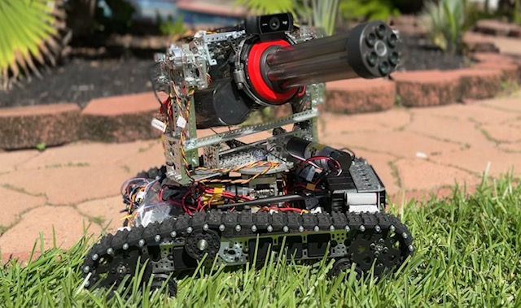

# Tank Robotics



ROS 2-based autonomous tracked robot running on an NVIDIA Jetson.

The Tank Robot combines real-time object detection, autonomous target tracking, Bluetooth joystick control, and RoboClaw motor control.

## System

```text
Logitech C922 Webcam
        │
        ▼
 v4l2_camera_node
        │
    /image_raw
        │
        ▼
 detector_node.py
        │
 /target_detection
        │
        ▼
poolbot_tracker_node.py ◄──── joystick_node.py
        │
        ▼
     RoboClaw
        │
        ▼
    Tank Motors
```

## Main Features

* Real-time YOLO object detection
* Autonomous target tracking
* Bluetooth joystick/manual control
* RoboClaw motor control
* ROS 2 Humble
* NVIDIA Jetson GPU acceleration
* Logitech C922 USB camera
* Python-based ROS 2 nodes

## Hardware

* NVIDIA Jetson Orin Nano
* Logitech C922 Pro Stream Webcam
* RoboClaw motor controller
* Tracked tank chassis
* DC gear motors
* Bluetooth game controller

## Software

* Ubuntu 22.04
* ROS 2 Humble
* Python 3.10
* Ultralytics YOLO
* PyTorch
* OpenCV
* NumPy
* PySerial
* `v4l2_camera`

## Repository Structure

```text
tank_ws/
├── README.md
├── MANUAL.md
├── requirements.txt
├── start_yoloros.sh
└── src/
    ├── poolbot_detector/
    │   ├── models/
    │   │   └── best.pt
    │   └── poolbot_detector/
    │       └── detector_node.py
    │
    └── poolbot_tracker/
        └── poolbot_tracker/
            ├── joystick_node.py
            ├── poolbot_tracker_node.py
            └── roboclaw_3.py
```

The ROS 2 package names currently remain `poolbot_detector` and `poolbot_tracker`. The overall project is called **Tank Robot**.

## Setup

Clone the repository:

```bash
git clone <repository-url>
cd tank_ws
```

Build the ROS 2 workspace:

```bash
source /opt/ros/humble/setup.bash
colcon build
```

Activate the project environment:

```bash
source start_yoloros.sh
```

The script sources ROS 2 Humble and activates the `yoloros3` Python environment.

## Camera

Install the ROS 2 V4L2 camera driver if required:

```bash
sudo apt install ros-humble-v4l2-camera
```

Start the camera:

```bash
ros2 run v4l2_camera v4l2_camera_node \
  --ros-args -p video_device:=/dev/video0
```

Verify the camera stream:

```bash
ros2 topic hz /image_raw
```

The current configuration provides approximately 30 FPS.

## Joystick

The standard ROS 2 `joy_node` is **not used**.

It was tested on the Jetson but did not provide reliable joystick input. The Tank Robot therefore uses a custom Python joystick node.

After pairing the Bluetooth controller:

```bash
python3 src/poolbot_tracker/poolbot_tracker/joystick_node.py
```

See `MANUAL.md` for Bluetooth pairing and troubleshooting.

## Detector

Start the YOLO detector:

```bash
source start_yoloros.sh

python3 src/poolbot_detector/poolbot_detector/detector_node.py
```

The detector subscribes to:

```text
/image_raw
```

and publishes:

```text
/target_detection
```

The trained model is:

```text
src/poolbot_detector/models/best.pt
```

## Tracker

Start the tracker:

```bash
source start_yoloros.sh

python3 src/poolbot_tracker/poolbot_tracker/poolbot_tracker_node.py
```

The tracker combines joystick input and autonomous target tracking and sends commands to the RoboClaw.

## Startup Order

For normal operation, start the components in this order:

1. Camera
2. Detector
3. Joystick
4. Tracker

Use separate terminals for each component.

## Safety

**Do not test the drive system with the tank on the ground until the complete control chain has been verified.**

During development, disconnect the motors or physically lift the tank so the tracks cannot contact the ground.

The tracker can issue motor commands automatically when autonomous tracking is active.

## Documentation

See [`MANUAL.md`](MANUAL.md) for:

* complete installation
* Python environment
* Bluetooth setup
* joystick operation
* camera configuration
* ROS 2 topics
* YOLO detection
* RoboClaw setup
* startup procedure
* troubleshooting
* Git workflow

## License

Copyright © 2026 Burkhard Sommer. All rights reserved.

This project and its source code are proprietary. No permission is granted to copy, modify, distribute, sublicense, or use the source code or other project materials without prior written permission from the copyright holder.

Some portions of the source code were developed with the assistance of AI-based programming tools. AI assistance does not imply that third-party ownership rights are transferred to this repository; applicable third-party licenses and rights remain in effect.
